# 🌐 Scalable Enterprise Network Transformation

## 🏢 Secure Multi-Floor Campus, Data Center and Branch Infrastructure


---

## 📌 Project Overview

This project demonstrates the transformation of a basic organizational network into a secure, scalable and highly available enterprise infrastructure.

The solution connects:

* 🏢 A three-floor headquarters
* 🗄️ A centralized data center
* 🏬 A remote branch office
* 🔥 A firewall-protected DMZ
* 🌍 A simulated ISP and internet
* 📡 Corporate and Guest wireless networks
* ☎️ Separate IP-phone voice networks

The complete topology was designed, configured, tested and documented using Cisco Packet Tracer.

### 📥 Project File

[Download the Cisco Packet Tracer project](Enterprise-Network.pkt)

---

## ❗ Business Problem

A growing organization operating through a flat and non-redundant network can experience several problems:

* Excessive broadcast traffic
* No separation between departments
* Unauthorized access to sensitive internal resources
* Manual and inconsistent IP address assignment
* Single points of network failure
* Insecure remote device administration
* No secure location for public-facing services
* Limited communication between headquarters and branch networks
* No dedicated networks for wireless and voice traffic

---

## ✅ Implemented Solution

The network was redesigned using a hierarchical enterprise architecture with:

* 🧩 Department-based VLAN segmentation
* 🔁 Redundant multilayer distribution switches
* 🌲 Rapid-PVST+ loop prevention and path optimization
* 🔗 LACP EtherChannel between distribution switches
* 🛡️ HSRP default-gateway redundancy
* 📦 Centralized DHCP address allocation
* 🔎 Internal DNS name resolution
* 🌐 Internal and public web services
* 🗺️ OSPF routing at headquarters
* 🏬 EIGRP routing for the branch office
* 🔄 Bidirectional OSPF–EIGRP redistribution
* 🔥 Cisco ASA firewall security zones
* 🌍 Dynamic PAT for enterprise internet access
* 📤 Static NAT for publishing the DMZ web server
* 🚫 Guest Wi-Fi isolation using extended ACLs
* 📶 WPA2-PSK wireless security
* 🔐 SSH version 2 for secure administration
* ☎️ Dedicated voice VLANs
* 🧪 Redundancy and failure-recovery testing

---

## 🗺️ Physical Topology

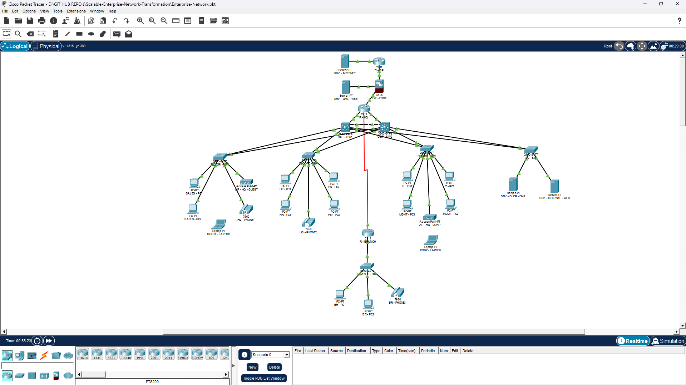

---

## 🏗️ Network Architecture

| Network area           | Devices                         | Purpose                                |
| ---------------------- | ------------------------------- | -------------------------------------- |
| 🌍 Internet edge       | R-ISP, FW-EDGE                  | ISP simulation, firewalling and NAT    |
| 🏢 Headquarters edge   | R-HQ                            | HQ routing and branch WAN termination  |
| 🔀 Distribution layer  | DIST-SW1, DIST-SW2              | Layer 3 switching, SVIs, HSRP and OSPF |
| 🖥️ Access layer       | FLOOR1-SW, FLOOR2-SW, FLOOR3-SW | Department and wireless connectivity   |
| 🗄️ Data center        | DC-SW                           | DHCP, DNS and internal web services    |
| 🏬 Branch office       | R-BRANCH, BRANCH-SW             | Branch users, voice and management     |
| 🔥 DMZ                 | SRV-DMZ-WEB                     | Public-facing web service              |
| 🌐 Internet simulation | SRV-INTERNET                    | External connectivity testing          |

---

## 🧩 VLAN and IP Addressing Plan

### 🏢 Headquarters VLANs

| VLAN | Name             | Subnet             | Virtual gateway |
| ---: | ---------------- | ------------------ | --------------- |
|   10 | SALES            | `10.10.10.0/24`    | `10.10.10.1`    |
|   20 | HR               | `10.10.20.0/24`    | `10.10.20.1`    |
|   30 | FINANCE          | `10.10.30.0/24`    | `10.10.30.1`    |
|   40 | IT               | `10.10.40.0/24`    | `10.10.40.1`    |
|   50 | MANAGEMENT       | `10.10.50.0/24`    | `10.10.50.1`    |
|   60 | SERVERS          | `10.10.60.0/24`    | `10.10.60.1`    |
|   70 | VOICE            | `10.10.70.0/24`    | `10.10.70.1`    |
|   80 | CORP-WIFI        | `10.10.80.0/24`    | `10.10.80.1`    |
|   90 | GUEST-WIFI       | `10.10.90.0/24`    | `10.10.90.1`    |
|   99 | NETWORK-MGMT     | `10.10.99.0/24`    | `10.10.99.1`    |
|  999 | NATIVE-BLACKHOLE | No Layer 3 address | None            |

### 🏬 Branch VLANs

| VLAN | Name             | Subnet             | Gateway      |
| ---: | ---------------- | ------------------ | ------------ |
|  110 | BRANCH-USERS     | `10.20.10.0/24`    | `10.20.10.1` |
|  120 | BRANCH-VOICE     | `10.20.20.0/24`    | `10.20.20.1` |
|  199 | BRANCH-MGMT      | `10.20.99.0/24`    | `10.20.99.1` |
|  999 | NATIVE-BLACKHOLE | No Layer 3 address | None         |

### 🔗 Routed and Edge Networks

| Connection         | Network           |
| ------------------ | ----------------- |
| R-HQ ↔ DIST-SW1    | `10.255.10.0/30`  |
| R-HQ ↔ DIST-SW2    | `10.255.10.4/30`  |
| R-HQ ↔ R-BRANCH    | `10.255.1.0/30`   |
| R-HQ ↔ FW-EDGE     | `10.255.2.0/30`   |
| FW-EDGE ↔ R-ISP    | `203.0.113.0/29`  |
| DMZ                | `172.16.10.0/24`  |
| Simulated internet | `198.51.100.0/24` |

---

## 🔁 High Availability

### 🛡️ HSRP Gateway Redundancy

HSRP provides a shared virtual gateway for every headquarters VLAN.

If one distribution switch becomes unavailable, the second switch assumes the Active gateway role.

Traffic ownership is distributed as follows:

* `DIST-SW1` is preferred for VLANs 10, 30, 50, 70, 90 and 99.
* `DIST-SW2` is preferred for VLANs 20, 40, 60 and 80.
* Preemption restores the preferred Active switch after recovery.

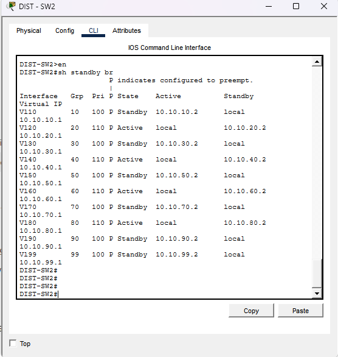

### 🌲 Rapid-PVST+

Rapid-PVST+ provides loop prevention and per-VLAN path optimization.

STP root ownership is aligned with HSRP gateway ownership to reduce unnecessary traffic across the distribution layer.

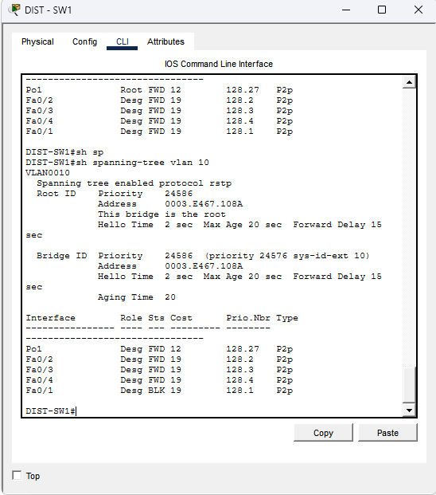

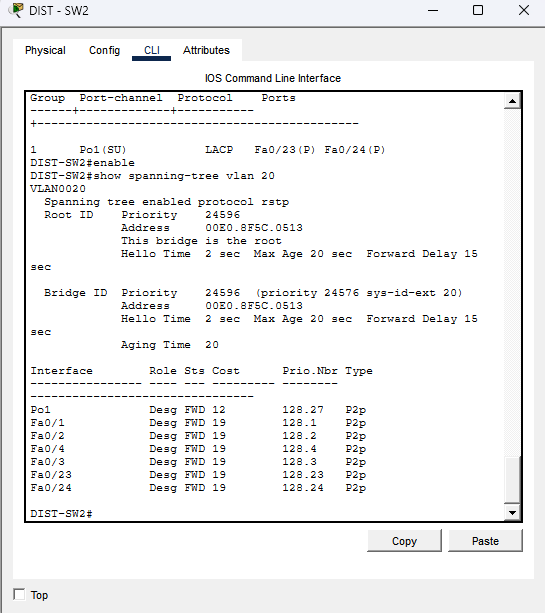

### 🔗 LACP EtherChannel

Two physical links between the distribution switches are bundled into `Port-Channel 1` using LACP.

Benefits include:

* Increased aggregate bandwidth
* Link-level redundancy
* Simplified STP operation
* Continued connectivity after one member-link failure

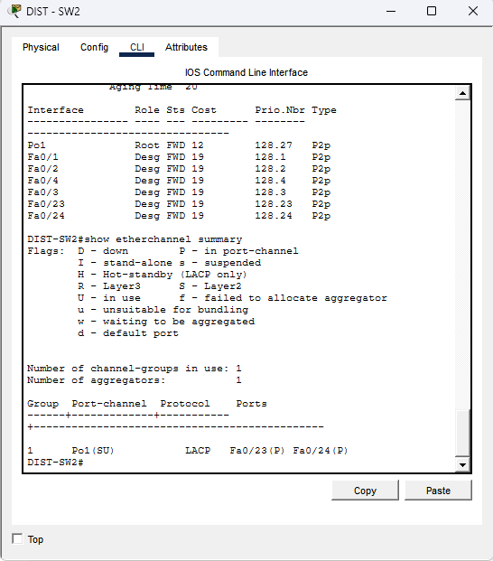

---

## 🗺️ Dynamic Routing

### 🏢 OSPF at Headquarters

OSPF Area 0 exchanges routes between:

* R-HQ
* DIST-SW1
* DIST-SW2

The distribution switches advertise the headquarters VLANs, while R-HQ learns equal-cost paths through both distribution switches.

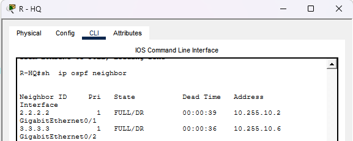

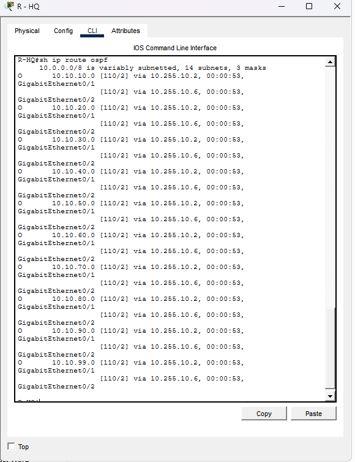

### 🏬 EIGRP at the Branch

EIGRP autonomous system 100 exchanges routes between R-HQ and R-BRANCH.

The following branch networks are advertised:

* `10.20.10.0/24`
* `10.20.20.0/24`
* `10.20.99.0/24`

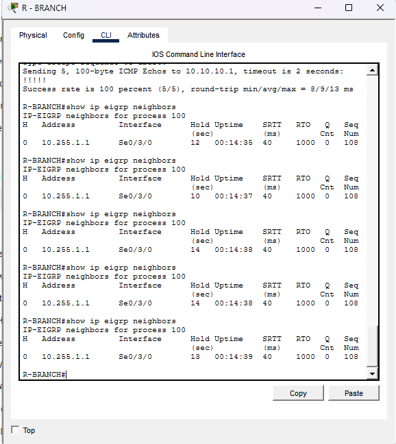

### 🔄 Route Redistribution

R-HQ performs bidirectional redistribution between OSPF and EIGRP.

This allows:

* Headquarters devices to reach branch networks
* Branch devices to reach headquarters networks
* Branch devices to learn the enterprise default route

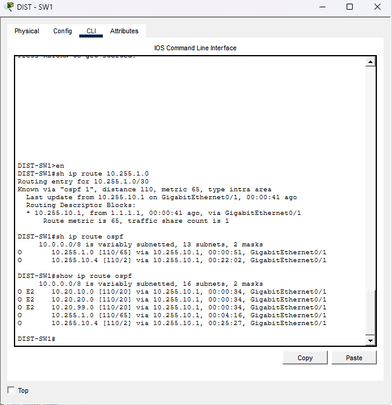

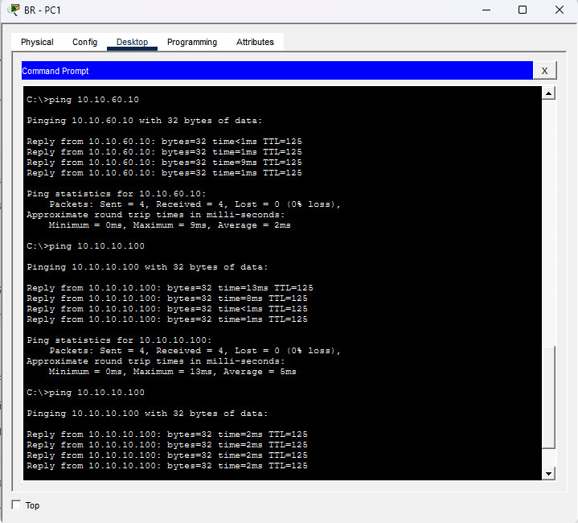

---

## 📦 Centralized Network Services

### 📡 DHCP

`SRV-DHCP-DNS` provides centralized IPv4 address allocation for:

* Headquarters department VLANs
* Corporate Wi-Fi
* Guest Wi-Fi
* Headquarters voice devices
* Branch users
* Branch voice devices

DHCP relay is implemented using `ip helper-address` on the Layer 3 gateway interfaces.

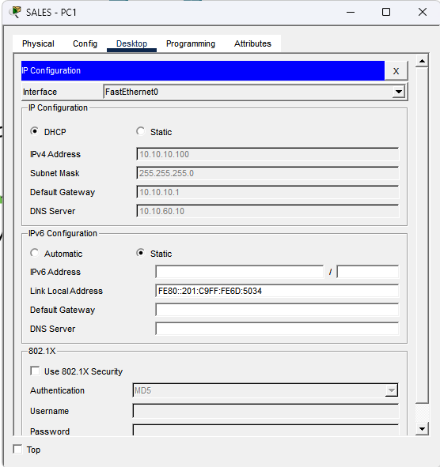

### 🔎 DNS

The internal DNS server provides name resolution for:

```text
intranet.entcorp.com → 10.10.60.20
```

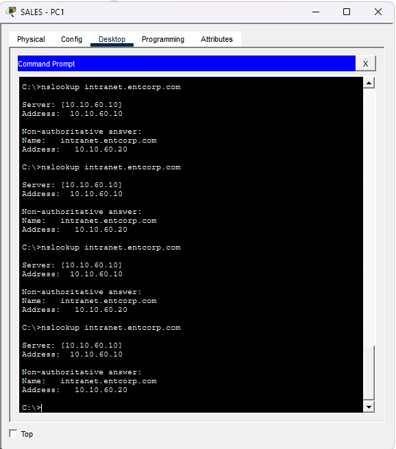

### 🌐 Internal Web Service

The internal web server is hosted at:

```text
10.10.60.20
```

It is accessible through:

```text
http://intranet.entcorp.com
```

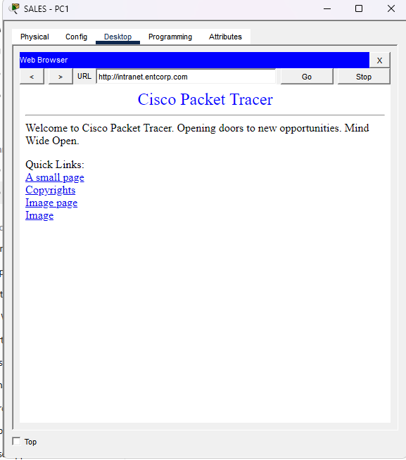

### 🔀 Inter-VLAN Routing

The multilayer distribution switches provide routing between authorized headquarters VLANs.

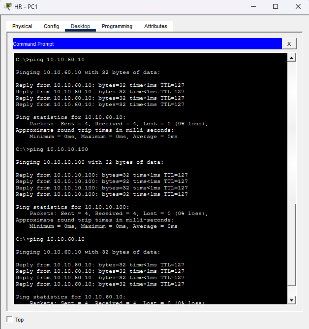

---

## 🔥 Firewall, DMZ and NAT

The Cisco ASA firewall contains three security zones:

| Zone       | Security level | Network                                    |
| ---------- | -------------: | ------------------------------------------ |
| 🔒 Inside  |            100 | Enterprise network through `10.255.2.0/30` |
| 🟠 DMZ     |             50 | `172.16.10.0/24`                           |
| 🌍 Outside |              0 | `203.0.113.0/29`                           |

### 🌍 Dynamic PAT

All authorized headquarters and branch private addresses are dynamically translated to the ASA outside-interface address:

```text
203.0.113.2
```

This allows multiple internal devices to share one public address.

### 📤 Static NAT

The DMZ web server is published through a dedicated public address:

```text
203.0.113.3 → 172.16.10.10
```

The outside ACL permits only the required web services:

* TCP port 80 for HTTP
* TCP port 443 for HTTPS

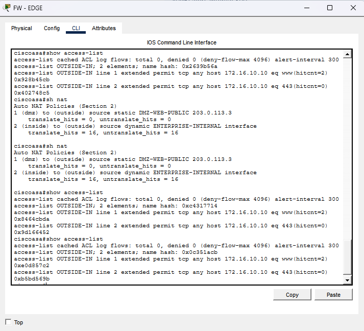

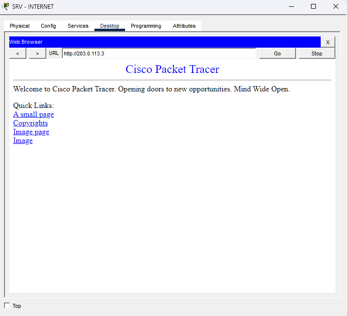

---

## 📶 Wireless Networks

### 🏢 Corporate Wi-Fi

| Setting    | Value                         |
| ---------- | ----------------------------- |
| SSID       | `ENT-CORP`                    |
| VLAN       | 80                            |
| Security   | WPA2-PSK                      |
| Encryption | AES                           |
| Access     | Internal network and internet |

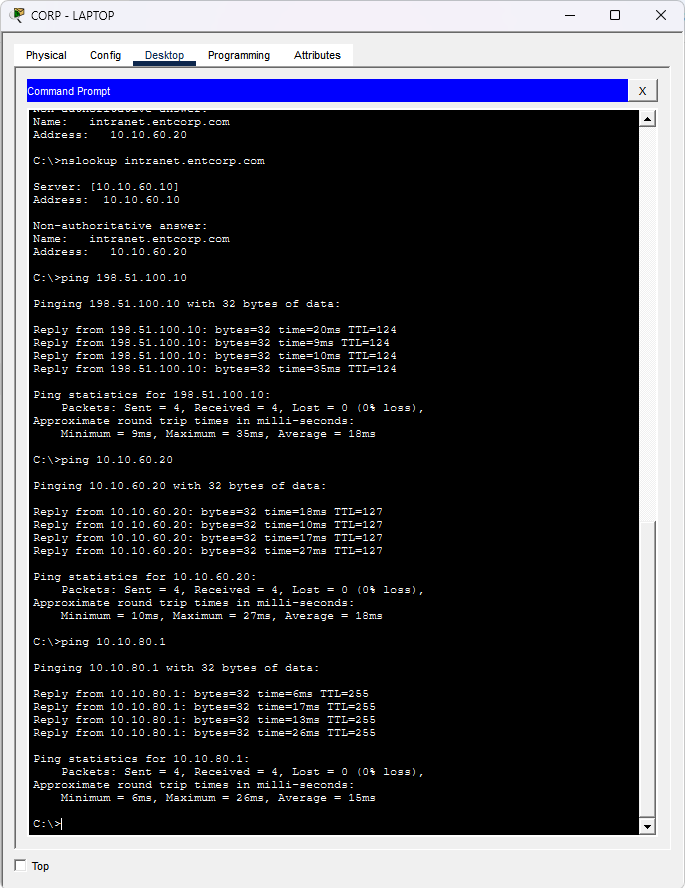

### 🚫 Guest Wi-Fi Isolation

| Setting           | Value                                    |
| ----------------- | ---------------------------------------- |
| SSID              | `ENT-GUEST`                              |
| VLAN              | 90                                       |
| Security          | WPA2-PSK                                 |
| Encryption        | AES                                      |
| Access            | DHCP, DNS and internet                   |
| Restricted access | Headquarters and branch private networks |

An extended ACL allows Guest Wi-Fi users to obtain DHCP addressing, resolve DNS queries and access the internet while blocking access to internal enterprise networks.

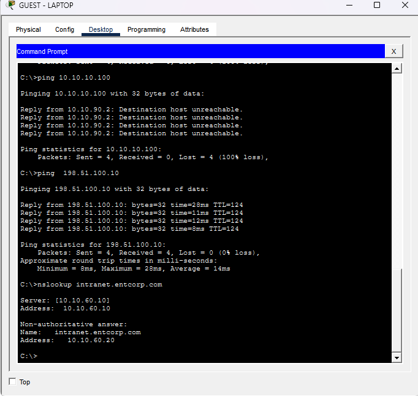

---

## 🔐 Secure Device Management

SSH version 2 is enabled using:

* Local administrator authentication
* RSA encryption keys
* Privileged administrator accounts
* SSH-only VTY access
* Dedicated management VLANs

| Device    | Management IP |
| --------- | ------------- |
| DIST-SW1  | `10.10.99.2`  |
| DIST-SW2  | `10.10.99.3`  |
| FLOOR1-SW | `10.10.99.11` |
| FLOOR2-SW | `10.10.99.12` |
| FLOOR3-SW | `10.10.99.13` |
| DC-SW     | `10.10.99.14` |
| BRANCH-SW | `10.20.99.2`  |

Telnet is disabled on the configured VTY lines by permitting SSH only.

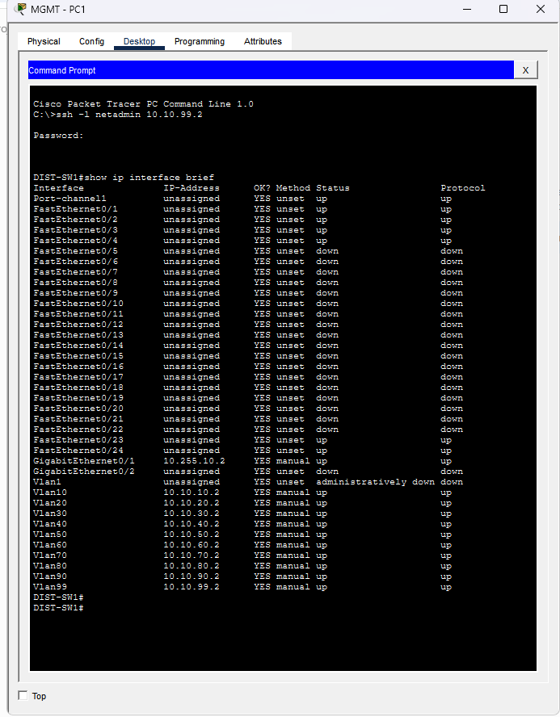

---

## ☎️ Voice Network

Separate voice VLANs isolate IP-phone traffic from regular user traffic:

* Headquarters Voice VLAN: `70`
* Branch Voice VLAN: `120`

The switch ports carry separate data and voice VLANs over the same physical connection.

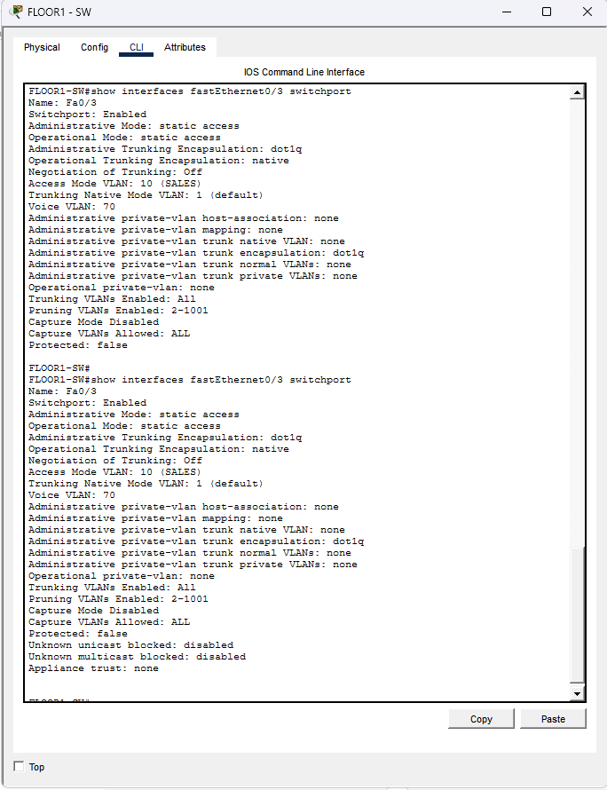

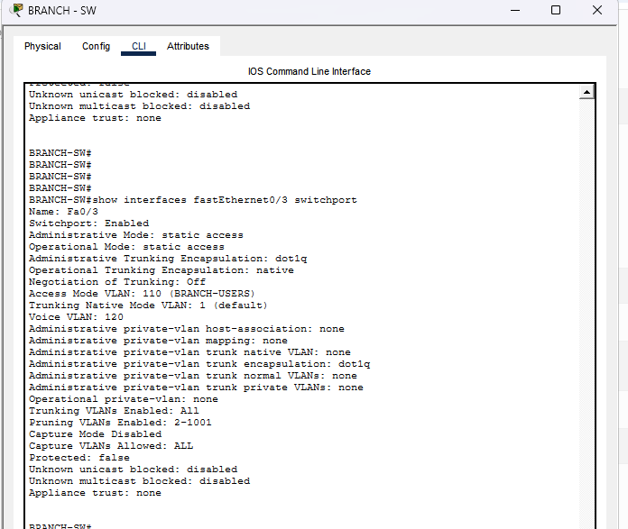

> **Packet Tracer limitation:** Cisco CME extension registration was not implemented because the selected 2911 IOS image does not support the `telephony-service` command. Voice VLANs, switch-port separation and DHCP/TFTP parameters were configured and verified.

---

## 🧪 Failure and Recovery Testing

### 🛡️ HSRP Failover Test

The VLAN 10 interface on DIST-SW1 was administratively disabled to simulate an Active gateway failure.

Results:

* DIST-SW2 became the Active HSRP gateway.
* The virtual gateway remained reachable.
* User internet connectivity continued.
* DIST-SW1 reclaimed the Active role after recovery because preemption was enabled.

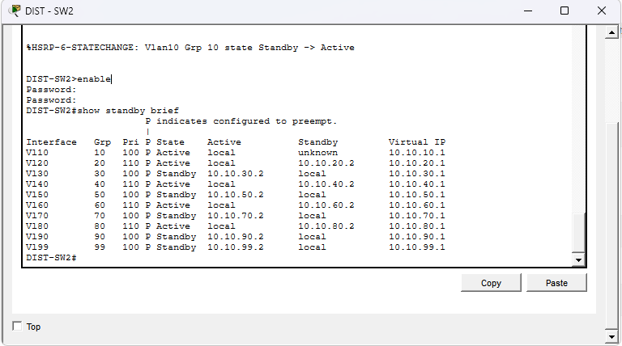

### 🔗 EtherChannel Member Failure

One LACP member link was administratively disabled.

The resulting state showed:

```text
Po1(SU)
Fa0/23(D)
Fa0/24(P)
```

Port-Channel 1 remained operational through the surviving member link, and network connectivity continued.

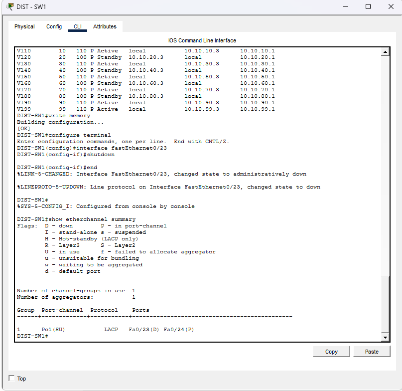

---

## ✅ Final End-to-End Validation

The completed network successfully demonstrated:

* ✅ Branch-to-HQ connectivity
* ✅ Inter-VLAN routing
* ✅ Centralized DHCP
* ✅ Internal DNS resolution
* ✅ Internal web access
* ✅ Corporate wireless access
* ✅ Guest-network isolation
* ✅ Headquarters and branch internet access
* ✅ Public access to the DMZ web server
* ✅ Secure SSH administration
* ✅ HSRP gateway failover
* ✅ EtherChannel link redundancy

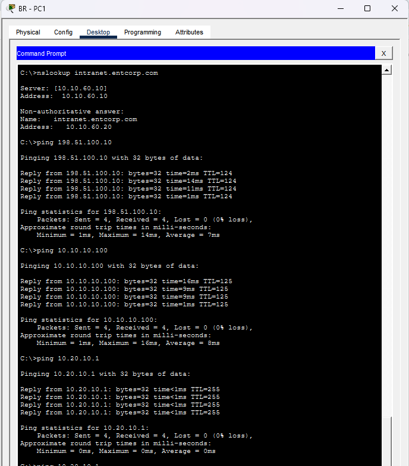

---

## 🛠️ Troubleshooting Performed

| Problem                                  | Root cause                                                    | Resolution                                               |
| ---------------------------------------- | ------------------------------------------------------------- | -------------------------------------------------------- |
| Servers could not reach their gateway    | Static addressing was missing                                 | Assigned correct IP addresses, masks and gateways        |
| DNS requests timed out                   | DNS record was configured on the web server                   | Created the record on SRV-DHCP-DNS                       |
| Branch DHCP failed                       | Incorrect Branch Users pool address                           | Corrected the pool to the `10.20.10.0/24` network        |
| Guest laptop received an APIPA address   | DHCP traffic was blocked on the alternate distribution switch | Permitted DHCP traffic through the ACL on both switches  |
| DMZ gateway was unreachable              | Gateway was entered as `176.16.10.1`                          | Corrected it to `172.16.10.1`                            |
| ASA DMZ name was not retained            | ASA 5505 third-VLAN licence restriction                       | Applied `no forward interface Vlan1` before `nameif dmz` |
| Static service PAT was rejected          | Packet Tracer ASA limitation                                  | Used a dedicated public IP with static NAT               |
| HSRP uplink tracking did not react       | Packet Tracer simulation limitation                           | Verified failover by disabling the Active SVI            |
| Phones remained on CM-list configuration | Router IOS lacked CME commands                                | Verified voice VLANs and switch-port configuration       |

---

## 🧠 Skills Demonstrated

* 🌐 Enterprise network design
* 🧮 IPv4 addressing and subnetting
* 🧩 VLANs and inter-VLAN routing
* 🔗 VTP and 802.1Q trunking
* 🌲 STP and Rapid-PVST+
* 🔁 LACP EtherChannel
* 🛡️ HSRP
* 🗺️ OSPF
* 🏬 EIGRP
* 🔄 Route redistribution
* 📦 DHCP and DHCP relay
* 🔎 DNS
* 🌐 HTTP and HTTPS services
* 🔥 Cisco ASA configuration
* 🌍 NAT and PAT
* 🚫 Extended ACLs
* 📶 Wireless security
* 🔐 SSH administration
* 🧪 Failure testing
* 🛠️ Network troubleshooting
* 📝 Technical documentation

---

## 📁 Project Structure

```text
Scalable-Enterprise-Network-Transformation/
├── Enterprise-Network.pkt
├── README.md
└── screenshots/
    ├── 01-Physical-Topology.png
    ├── 02-EtherChannel-Verification.png
    ├── 03-Rapid-PVST-VLAN10-Root.png
    ├── 04-Rapid-PVST-VLAN20-Root.png
    ├── 05-HSRP-Active-Standby.png
    ├── 06-DHCP-Sales-PC.png
    ├── 07-Inter-VLAN-Routing.png
    ├── 08-DNS-Resolution.png
    ├── 09-Internal-Web-Portal.png
    ├── 10-OSPF-Neighbors.png
    ├── 11-OSPF-Learned-Routes.png
    ├── 12-OSPF-EIGRP-Redistribution.png
    ├── 13-EIGRP-Neighbor.png
    ├── 14-Branch-to-HQ-Connectivity.png
    ├── 15-NAT-PAT-Verification.png
    ├── 16-Public-DMZ-Web-Access.png
    ├── 17-Guest-WiFi-Isolation.png
    ├── 18-Corporate-WiFi-Connectivity.png
    ├── 19-SSH-Remote-Management.png
    ├── 20-HQ-Voice-VLAN-Verification.png
    ├── 21-Branch-Voice-VLAN-Verification.png
    ├── 22-HSRP-Failover.png
    ├── 23-EtherChannel-Link-Failure.png
    └── 24-End-to-End-Connectivity.png
```

---

## 👨‍💻 Author

**Jay Kishan Choudhari**

Electronics and Communication Engineering graduate focused on networking, cloud infrastructure, Linux, Windows Server and IT support.

🔗 [GitHub Profile](https://github.com/Jay-C-Lab07)

---

## 📚 Detailed Project Documentation

Use these documents to study, reproduce, verify, and explain the complete project:

- 🛠️ [Device Configuration Summary](Configuration/Device-Configuration-Summary.md) — Configurations performed on each device
- ✅ [Verification Commands](Configuration/Verification-Commands.md) — Commands used to verify every technology
- 🗺️ [IP Addressing and Port Map](Documentation/IP-Addressing-and-Port-Map.md) — Device connections, ports, VLANs, and IP addresses
- 🔧 [Troubleshooting Report](Documentation/Troubleshooting-Report.md) — Problems encountered, root causes, solutions, and lessons learned
- 🎓 [Interview Preparation](Documentation/Interview-Preparation.md) — Project explanation and interview questions with answers

## ⭐ Support

If you found this project useful, consider giving the repository a star.
